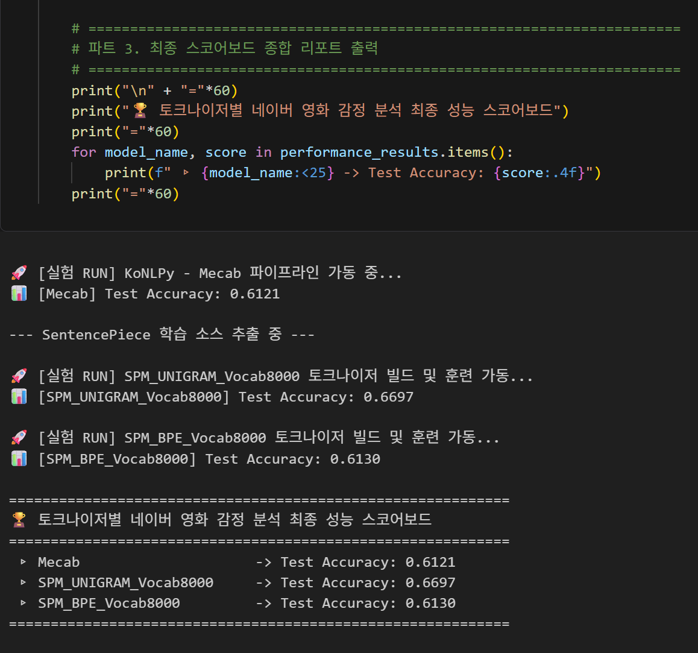
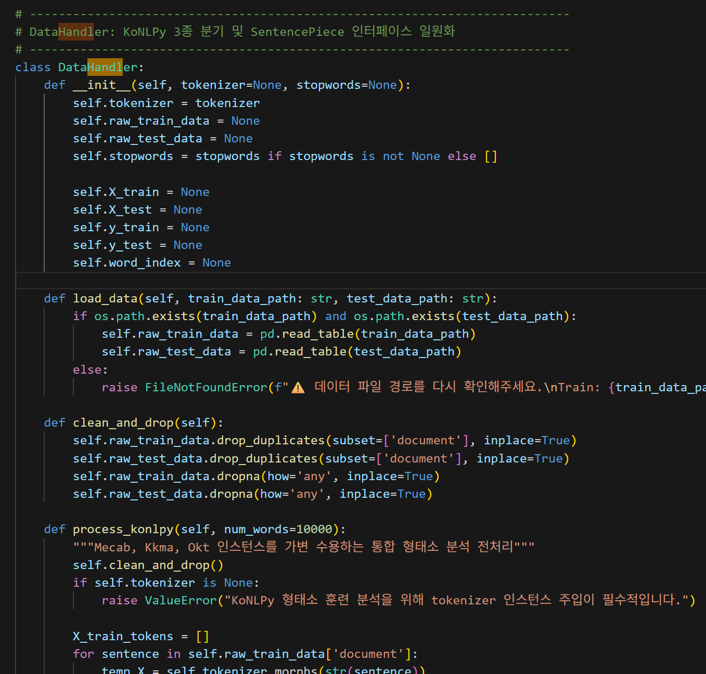
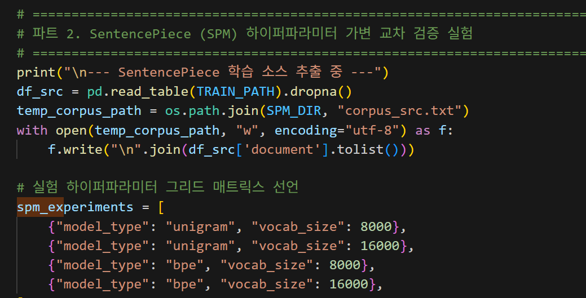

# AIFFEL Campus Online Code Peer Review Templete
- 코더 : 오용석
- 리뷰어 : 김택훈


# PRT(Peer Review Template)
- [x]  **1. 주어진 문제를 해결하는 완성된 코드가 제출되었나요?**
    - 문제에서 요구하는 최종 결과물이 첨부되었는지 확인
        - 중요! 해당 조건을 만족하는 부분을 캡쳐해 근거로 첨부
        
    
- [x]  **2. 전체 코드에서 가장 핵심적이거나 가장 복잡하고 이해하기 어려운 부분에 작성된 
주석 또는 doc string을 보고 해당 코드가 잘 이해되었나요?**
    - 일원화된 `DataHandler`, `TrainHandler`, `LSTMModel`로 데이터 전처리, 모델 구성, 학습 단계를 분리하고, 학습 코드에 TRAIN LOOP, VALIDATION LOOP, TEST LOOP가 구분되어 있어 전체 흐름을 파악하기 쉬웠습니다.



        
- [x]  **3. 에러가 난 부분을 디버깅하여 문제를 해결한 기록을 남겼거나
새로운 시도 또는 추가 실험을 수행해봤나요?**
    - SentencePiece 중 unigram/BPE 및 vocab size 8,000/16,000 조합을 실험하였다.
    - JVM heap 크기 설정, 느린 형태소 분석기를 위한 선택적 샘플링 코드, 예외 발생 시 다음 실험으로 넘어가는 처리 등 실행 안정성을 고려한 시도가 확인된다. (Okt/kkma 터짐이슈...)
    - 3 epoch 실험 이후 10 epoch 조건으로 다시 실행하여 학습 횟수에 따른 변화도 확인하였다.

        
- [ ]  **4. 회고를 잘 작성했나요?**
    - 아직 작성하지 못했다고 하심 
        
- [x]  **5. 코드가 간결하고 효율적인가요?**
    - GPT said: 
    - 클래스와 함수로 기능을 분리하여 전체적인 구조는 잘 모듈화되어 있다. <--  
    - SentencePiece vocab 파일을 `glob` 결과의 첫 번째 파일로 선택하므로 현재 모델과 다른 vocab이 연결될 가능성이 있다. 
    - 고정 길이 padding 후 LSTM의 마지막 hidden state를 그대로 사용하면 padding 이후의 상태가 분류에 사용될 수 있다. 실제 길이를 계산하여 `pack_padded_sequence`를 사용하거나 마지막 실제 token 위치를 선택하는 방식이 더 적절하다.


# 회고(참고 링크 및 코드 개선)
```
SP 기반 토크나이저의 계열(bpe vs unigram)과 vocab size(8k vs 16k)를 중심으로 비교한 결과를 공유해주셨고, 서로 다른 구조의 LSTM(FC 1 VS 2)을 구현했는데 이를 통해 모델의 형태에 대한 차이도 알아볼 수 있어 유익했습니다. 코드 설명을 매우 세세하게 해주셔서 저도 잘 모르고 모호하게 지나갔던 흐름을 잘 다지게 되었습니다. 
```
EOF`
